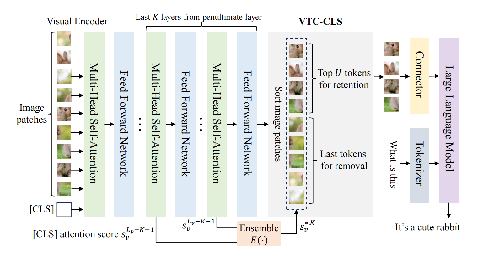
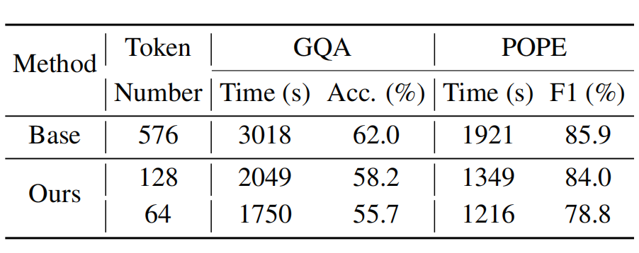

# [CLS] Token Tells Everything Needed for Training-free Efficient MLLMs

This is the official implementation of VTC-CLS, a state-of-the-art effective method for training-free visual token compression in Multimodal Large Language Models.

Our VTC-CLS is simple and can serve as a plug-and-play method to accelerate the inference of MLLMs in a training free manner, showing high practicality.

## News
- [x] [2024.12.10] we open-sourced our code!

## Environmental Setup
```bash
conda create -n VTC-CLS python=3.10
pip install -r requirements.txt
```
- Download [LLaVA-1.5-7B](https://huggingface.co/Zuyan/ElasticCache/tree/main/llava-v1.5-7b) and put it at `../models/`.

## Performance
We tested our VTC-CLS method on various models with different compression ratios, and display LLaVA results here. Compared with existing methods including FastV and LLaVA-prumerge, our method is state-of-the-art in training-free manner.


## Efficiency
We measure the evaluation time and show our method can effectively speed-up the inference process of MLLMs. We display the inference time of LLaVA-v1.5-7B on some test datasets before and after applying our VTC-CLS method. 



## Evaluation
You can simply run scripts under ./scripts/v1_5/eval. You should specify the **start layer** and the **token num to keep** in command line(except for reproduce).

### GQA

1. Download the [data](https://cs.stanford.edu/people/dorarad/gqa/download.html) and [evaluation scripts](https://cs.stanford.edu/people/dorarad/gqa/evaluate.html) following the official instructions and put under `../data/gqa/data`. You may need to modify `eval.py` as [this](https://gist.github.com/haotian-liu/db6eddc2a984b4cbcc8a7f26fd523187) due to the missing assets in the GQA v1.2 release.
2. Single-GPU or Multi-GPU inference and evaluate.
```Shell
method=VTC-CLS # Option: {FastV, llava_prumerge}
bash scripts/v1_5/eval/$method/gqa.sh $layer $token_num
bash scripts/v1_5/eval/reproduce/gqa.sh
```

### ScienceQA

1. Under `../data/scienceqa`, download `images`, `pid_splits.json`, `problems.json` from the `data/scienceqa` folder of the ScienceQA [repo](https://github.com/lupantech/ScienceQA).
2. Single-GPU or Multi-GPU inference and evaluate.
```Shell
method=VTC-CLS # Option: {FastV, llava_prumerge}
bash scripts/v1_5/eval/$method/sqa.sh $layer $token_num
bash scripts/v1_5/eval/reproduce/sqa.sh
```

### TextVQA

1. Download [`TextVQA_0.5.1_val.json`](https://dl.fbaipublicfiles.com/textvqa/data/TextVQA_0.5.1_val.json) and [images](https://dl.fbaipublicfiles.com/textvqa/images/train_val_images.zip) and extract to `../data/textvqa`.
2. Single-GPU or Multi-GPU inference and evaluate.
```Shell
method=VTC-CLS # Option: {FastV, llava_prumerge}
bash scripts/v1_5/eval/$method/textvqa.sh $layer $token_num
bash scripts/v1_5/eval/reproduce/textvqa.sh
```

### POPE

1. Download `coco` from [POPE](https://github.com/AoiDragon/POPE/tree/e3e39262c85a6a83f26cf5094022a782cb0df58d/output/coco) and put under `../data`.
2. Single-GPU or Multi-GPU inference and evaluate.
```Shell
method=VTC-CLS # Option: {FastV, llava_prumerge}
bash scripts/v1_5/eval/$method/pope.sh $layer $token_num
bash scripts/v1_5/eval/reproduce/pope.sh
```

### MMBench

1. Download [`mmbench_dev_20230712.tsv`](https://download.openmmlab.com/mmclassification/datasets/mmbench/mmbench_dev_20230712.tsv) and put under `../data/mmbench`.
2. Single-GPU or Multi-GPU inference and evaluate.
```Shell
method=VTC-CLS # Option: {FastV, llava_prumerge}
bash scripts/v1_5/eval/$method/mmbench.sh $layer $token_num
bash scripts/v1_5/eval/reproduce/mmbench.sh
```
3. Submit the results to the [evaluation server](https://opencompass.org.cn/leaderboard-multimodal): `../data/eval/mmbench/answers_upload/mmbench_dev_20230712`.

### MMBench-CN

1. Download [`mmbench_dev_cn_20231003.tsv`](https://download.openmmlab.com/mmclassification/datasets/mmbench/mmbench_dev_cn_20231003.tsv) and put under `../data/mmbench`.
2. Single-GPU or Multi-GPU inference and evaluate.
```Shell
method=VTC-CLS # Option: {FastV, llava_prumerge}
bash scripts/v1_5/eval/$method/mmbench_cn.sh $layer $token_num
bash scripts/v1_5/eval/reproduce/mmbench_cn.sh
```
3. Submit the results to the evaluation server: `../data/eval/mmbench/answers_upload/mmbench_dev_cn_20231003`.


### SEED-Bench

1. Following the official [instructions](https://github.com/AILab-CVC/SEED-Bench/blob/main/DATASET.md) to download the images and the videos. Put images under `../data/seed_bench/SEED-Bench-image`. Note that we only use image subset to evaluate.
2. Single-GPU or Multi-GPU inference and evaluate.
```Shell
method=VTC-CLS # Option: {FastV, llava_prumerge}
bash scripts/v1_5/eval/$method/seed.sh $layer $token_num
bash scripts/v1_5/eval/reproduce/seed.sh
```

### MM-Vet

1. Extract [`mm-vet.zip`](https://github.com/yuweihao/MM-Vet/releases/download/v1/mm-vet.zip) to `../data/mmvet`.
2. Single-GPU or Multi-GPU inference and evaluate.
```Shell
method=VTC-CLS # Option: {FastV, llava_prumerge}
bash scripts/v1_5/eval/$method/mmvet.sh $layer $token_num
bash scripts/v1_5/eval/reproduce/mmvet.sh
```
3. Evaluate the predictions in `../data/eval/mmvet/results` using the official jupyter notebook.

## Acknowledgement
Our codebase is partly built with [LLaVolta](https://github.com/Beckschen/LLaVolta/tree/main) and [LLaVA-PruMerge](https://github.com/42Shawn/LLaVA-PruMerge/tree/main/llava/model).

Thanks for the great implementations!

## Citation
If our code or models help your work, please cite our paper:
TODO
